# **부스트캠프 AI Tech 5기 07조 연어보다자연어조 Final Project**
## Chosen : 사용자의 입력에 따른 리뷰 기반 상품 추천 서비스

- [서빙 레포지토리](https://github.com/boostcampaitech5/level3_nlp_productserving-nlp-07) 

[CHOSEN](http://chosen.o-r.kr/)

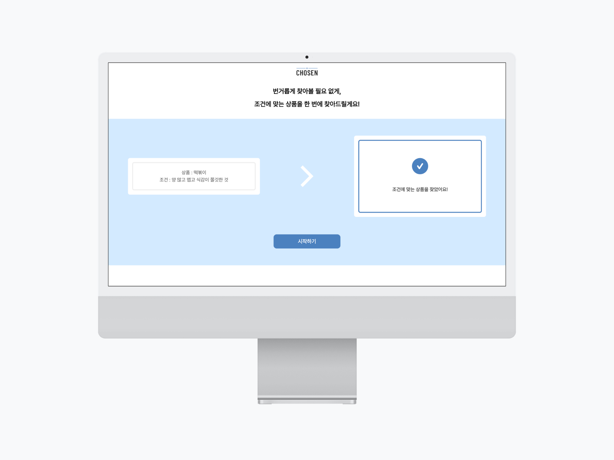

  

# 👋 반갑습니다.

안녕하세요. 저희 `연어보다자연어` 팀은 2023년 6월 30일 ~ 7월 28일까지  **사용자의 입력에 따른 리뷰 기반 상품 추천 서비스** 를 진행했습니다. 쿠팡의 리뷰데이터를 수집하여 **AI 모델로 요약문을 생성**했습니다. 요약문을 query 로, 리뷰데이터를 context 로 사용하여 **retrieve 모델을 학습**시켰습니다. 이것을 토대로 사용자 입력에 맞는 상품을 추천해주는 리뷰 기반 AI 서비스를 개발했습니다.

 

## 팀원 소개

|  |  |  |  |  |
| --- | --- | --- | --- | --- |
| 권지은_T5018 [@lectura7942](https://github.com/lectura7942) | 김재연_T5051 [@JLake310](https://github.com/JLake310) | 박영준_T5087 [@hoooolllly](https://github.com/hoooolllly) | 정다혜_T5189 [@Da-Hye-JUNG](https://github.com/Da-Hye-JUNG) | 최윤진_T5218 [@yunjinchoidev](https://github.com/yunjinchoidev) |

 

## 팀원 역할

- `권지은`: 데이터 필터링, 요약 모델 학습 데이터 제작, 요약 모델 학습 및 평가, 요약 API 제작
- `김재연`: Project Manager, DPR 학습 및 평가, 데이터 필터링, 프론트엔드 개발, 배포 및 유지/보수
- `박영준`: 데이터 필터링, 요약 모델 학습 데이터 제작
- `정다혜`: 요약 모델 학습 데이터 제작, 요약 모델 학습 및 평가
- `최윤진`: 데이터 수집, Airflow 스케줄링, DB API

  

# 🙌 프로젝트를 소개합니다.

## 문제 정의

세상엔 상품이 너무 많습니다.🤔  동시에 고객이 원하는 **조건**들은 점점 다양해지고 있습니다. 

많은 사람들이 자신에게 맞는 상품들을 고르기 위해 리뷰를 찾아보면서 제품들을 비교하며 고르고 있습니다. 이 과정에서 많은 시간이 허비되곤 합니다.

**저희 팀은 이런 불편함을 확인하고, 해결책으로써 리뷰 데이터에 주목했습니다.** 🔎 상품의 생생한 사용 후기와 느낌이 반영되어 있는 리뷰 데이터는 가치있는 데이터라고 할 수 있습니다. 

**딥러닝 모델을 통해 리뷰를 분석하고 사용자의 입력 조건에 맞는 상품을 추천해준다면 쇼핑에 불필요하게 낭비되는 시간을 절약**할 수 있을 거라는 생각을 하게 되었습니다. 특히 **상품들이 많고 리뷰 수, 사용자가 많은 ‘쿠팡’**이 저희 프로젝트에 가장 적합하다고 생각했습니다. 상품의 종류가 너무 많아 식품 데이터에 한정했습니다.

 

## 우리는 이런 목표를 가지고 있어요.

✅ 사용자가 원하는 조건의 상품을 **한 눈에 모아볼 수 있도록** 하는 거예요.

✅ 사용자가 상품을 비교하고 선택하는 **시간을 줄일 수 있게** 도와주는 거예요.

✅ 피드백을 반영하여 추천 만족도를 **지속적으로** 높이도록 하는 거예요.

  

# ✈️ 먼저 서비스가 어떻게 돌아가는 지 보여드릴게요.

### 📌 한번 사용해보세요. 👉 [CHOSEN](http://chosen.o-r.kr/)

### 📌 바쁘신 분들을 위해 **데모 영상**을 첨부합니다.

- 검색한 상품이 DB 에 저장 된 경우
  
    
    
    
- 검색한 상품이 저장되지 않아 실시간 크롤링 하는 경우
  
    

    

### 📌 데이터베이스에 검색한 상품이 있는가 없는가에 따라 서비스 플로우가 달라집니다.

- 데이터베이스에 저장된 상품의 경우 10초 안에 결과를 볼 수 있습니다.
- 저장되지 않은 경우엔 실시간으로 데이터를 크롤링을 해서 1분 30초 ~2분 정도 시간이 소요됩니다.

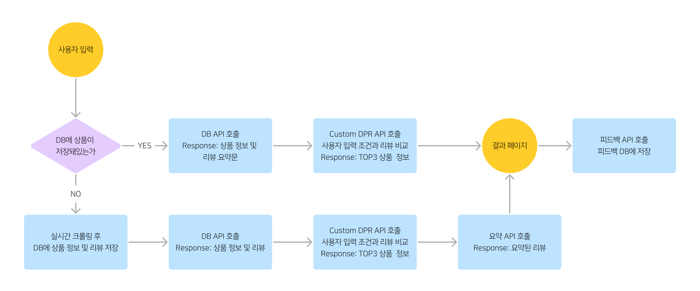

  

# ⏰ 저희는 이렇게 프로젝트를 진행했습니다.

이 글을 보는 여러분들께 저희 팀이 **어떤 문제를, 어떻게 해결해나갔는지** 말씀 드리고 싶습니다. 
**네 가지 관점**에서 저희의 이야기를 들려드리겠습니다. 

1️⃣ 어떻게 하면 **양질의 데이터**를 수집할 수 있을까?

2️⃣ 어떻게 하면 문서를 **키워드 중심으로 요약**할 수 있을까?

3️⃣ 어떻게 하면 비정형화된 **사용자의 피드백 데이터**를 다룰 수 있을까?

4️⃣ 어떻게 하면 서비스의 **결과를 보는 시간**을 줄일 수 있을까?

  

## 1️⃣ 어떻게 하면 **양질의 데이터**를 수집할 수 있을까?

AI 프로젝트의 첫 출발은 데이터 수집입니다. 이 과정에서 나온 데이터의 품질이 모델의 성능을 결정짓습니다. 

저희는 양질의 데이터를 수집하기 위해 노력하면서 여러 문제를 마주쳤습니다. **어떤 기준에 맞추어 데이터를 선별** 하는 게 좋을 지, 중요하지 않은 텍스트를 어떻게 **필터링하고 전처리할지** 고민해야 했습니다.

### 1-1 **상품 데이터 수집 기준 수립**

- **1 페이지에 나오는 임의의 제품들을 수집**
    
    쿠팡 검색을 하면 아래 화면처럼 36개 정도의 상품이 1페이지에 나옵니다. 처음엔 이 상품들을 **선별 없이** 모두 크롤링 했습니다. 검색 시 첫 페이지에 나오는 만큼 **보편적이고 다양한 제품들**이 나온다는 것을 알 수 있었습니다. 그만큼 사용자에게 여러 제품을 추천해준다는 점에서 이런 수집 방식은 장점을 가지고 있었지만, 동시에 **일반적인 선호도를 고려하지 못한다는 문제점**이 있었습니다. 
    

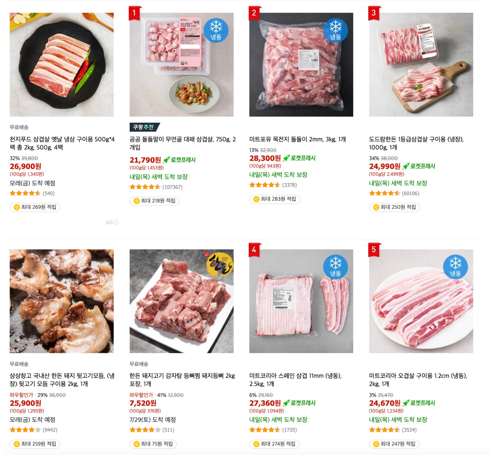

쿠팡에서 검색을 하면 약 36개의 상품이 나오고, top-10 상품에 대해선 상품 이미지 좌측 상단에 빨간 순위 태그가 붙습니다. 

- **쿠팡에서 선정한 TOP10 상품 수집**
상품 이미지 좌측 상단을 보면 쿠팡에서 자체적으로 선정한 ‘**쿠팡 랭킹**’ 이라는 게 있습니다. **리뷰 수, 인기도, 판매량 등을 고려해서 쿠팡 자체적으로 10개의 상품에 태그를 이미 붙여준 것입니다**. 저희는 이런 데이터들이 일반적인 선호도를 반영한다고 생각했고 이 데이터만 수집하기로 결정했습니다. **리뷰 수가 이미 많은 top-10 상품들은 저희의 목표인 리뷰 데이터 기반 상품 서비스에 더 적합하다는 점도 고려했습니다.💡**

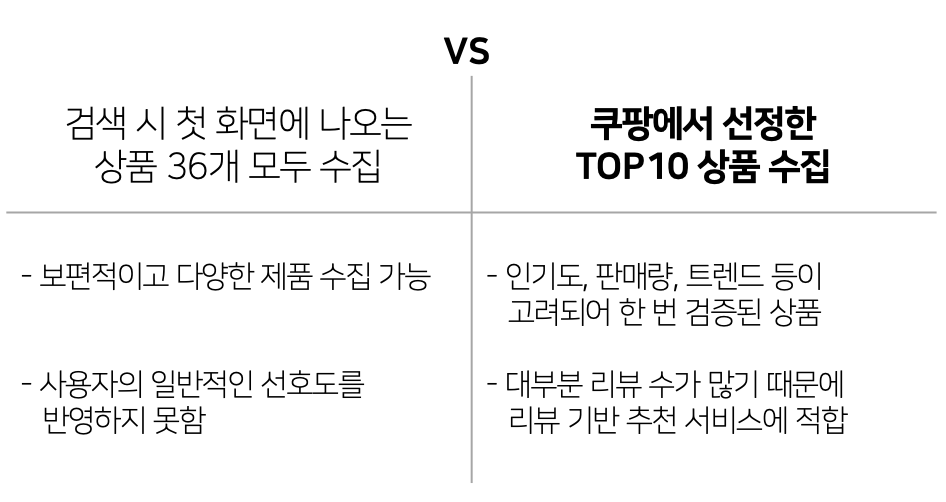

### 1-2 **리뷰 데이터 수집 기준 수립**

하나의 상품마다 20개의 리뷰를 수집했습니다. 리뷰 기반 추천 시스템이기 때문에 무엇보다 중요한 것은 리뷰 데이터의 품질이었습니다. 저희는 **리뷰의 길이, 유용성**을 기준으로 데이터의 수집 기준을 정했습니다. 

- **리뷰의 길이**
    
    리뷰 데이터가 **너무 짧거나** **너무 긴** 리뷰 데이터는 특성상 적합하지 않은 데이터라고 판단했습니다. 너무 짧은 텍스트는 표면적 감상에 치우쳐있고, 너무 긴 텍스트는 정보가 과도하게 퍼져있어서 사용하기엔 부적합하다고 판단 했기 때문입니다. ‘맛있어요’, ‘밥 맛이 땡겨요’ 와 같은 문장들이 대표적입니다.
    

- **유용성**
    
    쿠팡 자체적으로 ‘**도움이 돼요**’라는 지표를 가지고 있습니다. 이것이 한 번이라도 눌린 리뷰를 수집하여 **최소한의 유용성을 보장**하는 데이터를 

    
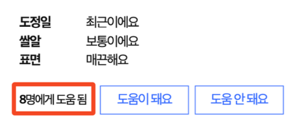

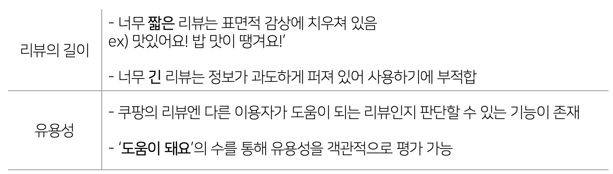

결론적으로 저희가 최종적으로 수립한 **<리뷰 데이터 수집 기준>** 은 아래와 같습니다. 

1. **50자 이상, 500자 이내 리뷰만 수집하여 정제 및 활용에 적합하도록 함**
2. **‘도움이 돼요’ 평가를 한 번이라도 받은 데이터만 수집하여 최소한의 유용성을 보장** 

### 1-3 데이터 필터링

하지만 이렇게 수집한 리뷰 데이터들은 당연히 문제를 가지고 있었습니다. 🤔  대표적으로 리뷰 데이터의 문장들을 구체적으로 확인해보았을 때 **요리 방법, 인사말 등 요약에 필요하지 않은 문장**들이 존재했습니다. 아래 그림을 보면 확실히 알 수 있습니다. 저희는 요약의 품질 향상 및 시간 단축을 위해 **데이터 필터링 전략**에 대해 고민을 하게 되었습니다. 

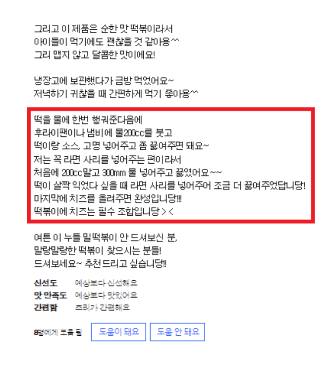

조리법 관련된 정보는 요약 정보에 필요하지 않습니다. 

저희는 크게 두 가지 방식에서 접근했습니다. 

첫번째는 **클러스터링 기반 필터링**이고, 두 번째는 **규칙 기반 필터링**입니다. 

- **클러스터링 기반 필터링**
    
    **Kmeans 클러스터링**을 통해 조리법 관련 문장들을 제거하기 위한 시도를 했습니다. ‘맛’, ‘식감’, ‘조리’ 와 같은 **클러스터**를 만들어서 제거하는 방법이었습니다. 아래 그림 처럼 ‘조리’ 를 통해 클러스터링을 하면 관련된 문장들이 클러스터를 형성하는 것을 알 수 있습니다. **하지만 제거 해야하는 문장의 절반도 필터링하지 못 했습니다. 😂**
    
    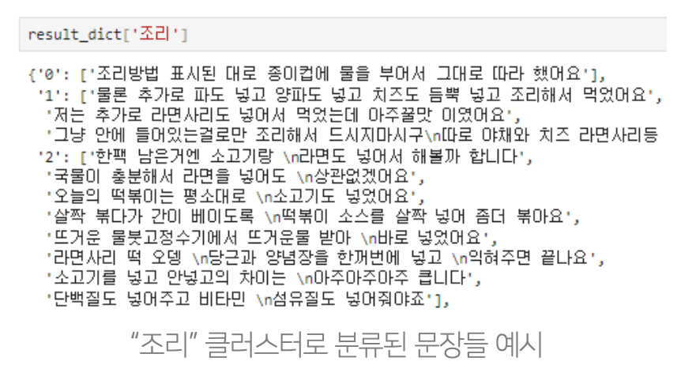
    

- **규칙 기반 필터링**
    
    그래서 저희는 조리법, 배송 등의 관련된 **키워드를 직접 추출하여 불필요한 문장을 제거**해주었습니다. 
    
    단순한 방법이었지만 효과적이었습니다. 🤖
    
    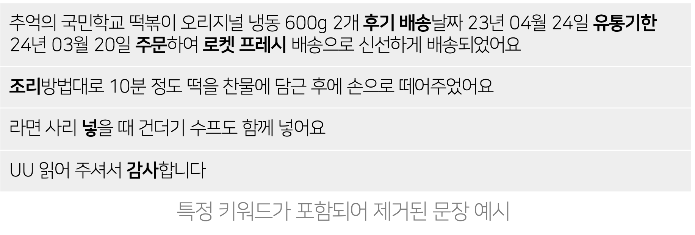
    

### 1-4 데이터 전처리

리뷰 데이터는 비정형 데이터이기 때문에 반드시 정제가 필요합니다. 아래 기준에 맞추어서 리뷰 데이터를 전처리 해주었습니다. hanspell 라이브러리를 이용해 맞춤법 검사도 해주었습니다. 

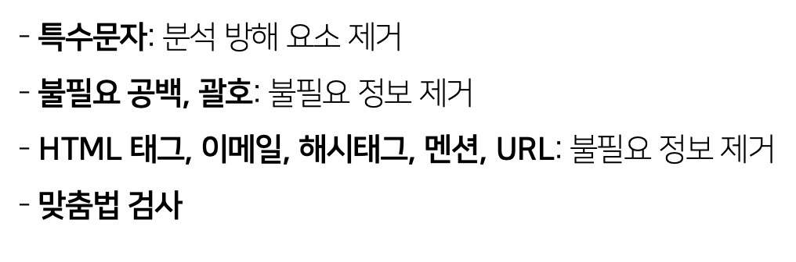

### 1-5 중복 상품 제거

**같은 상품이지만 중량 혹은 개수의 차이로 인해 쿠팡 top-10 랭킹에 여러 상품으로 표시되는 경우**도 있었습니다. 쿠팡에서 부여한 **고유 상품 번호**를 이용해서 중복된 데이터가 수집되는 것을 방지했습니다.

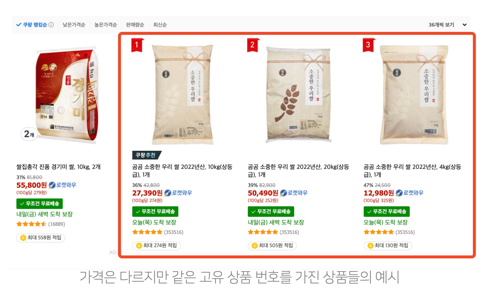

저희는 위 과정을 거쳐 총 **506**개의 검색어에 대한 **4983**개의 상품 데이터, **77732**개의 리뷰 데이터를 수집했습니다.

  

## 2️⃣ 어떻게 하면 문서를 **키워드 중심으로 요약**할 수 있을까?

수집한 리뷰 데이터를 다 보기에는 길이도 길고, 중복된 내용도 너무 많았습니다. 

사용자가 원하는 조건과 비교하기 위해서는 더 정돈된 문서가 필요했는데요, 중요한 정보만 남기고 불필요한 정보는 버리는 좋은 모델, 어디 없을까요? 👀  

### 2-1 요약 모델 학습 데이터 제작

좋은 모델을 위해서는 좋은 데이터가 필요합니다. 저희가 어떻게 좋은 데이터를 구성했는지 확인하러 가봅시다 😃

- **요약 데이터**
    
    저희가 필요로 하는 정보가 무엇인지 학습시키기 위해 요약 데이터의 형식을  **`<특성>** 내용` 로 정했습니다.
    
    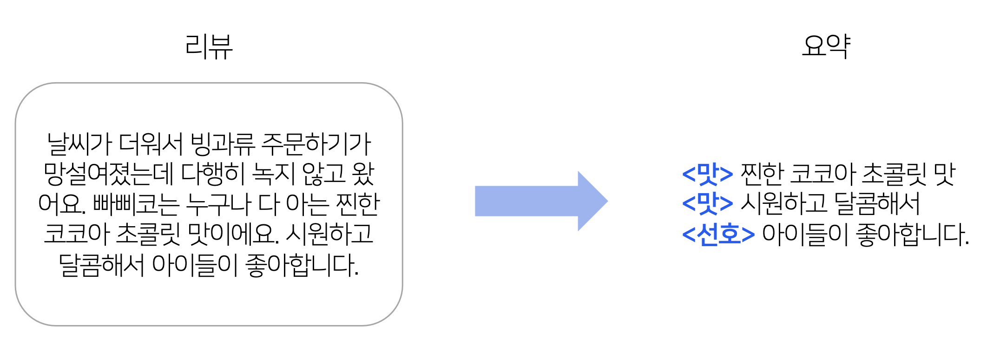
    
- **ChatGPT로 요약 데이터 제작**
    
    본 프로젝트에서 필요한 요약 데이터의 형식이 기존에 없어서 생성 AI를 활용해 데이터를 생성하고자 했습니다. 우선, ChatGPT로 데이터 생성을 시도했습니다.
    
    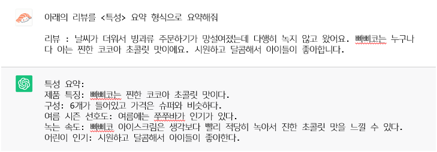
    
    ChatGPT가 원하는 output대로 요약을 하지 못한다는 점을 발견했습니다. 따라서 **프롬프트 엔지니어링을** 시도하였습니다.
    
    1. 프롬프트 엔지니어링 시도 - 요구 사항 명시
        
        첫 번째로 요구사항을 다음과 같이 명시해주었습니다.
        
        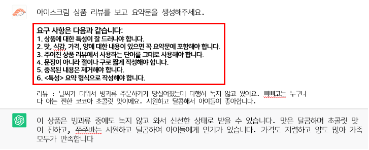
        
        요구사항중에 **일부 사항을 반영**한것을 확인할 수 있었으나, 원하는 output을 얻지 못하였습니다. 따라서 **예시를 추가**하는 시도를 하였습니다.
        
    2. 프롬프트 엔지니어링 시도 - 예시 추가
        
        두 번째로 주어질 리뷰와 원하는 요약을 형식에 맞추어 명시해주었습니다.
        
        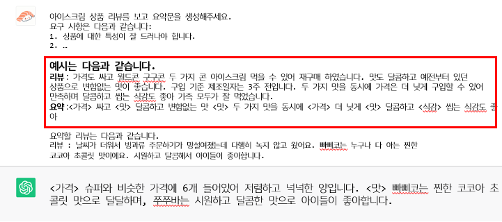
        
        정성적으로 확인해보았을 때 저희가 원하는 output과 유사하게 나온 것을 확인하였으나, 요약이 아닌 **문장을 그대로 가져온 것**을 확인하였습니다. 따라서 **추가 요구사항을 다시 한번 명시해주는 시도**를 하기로 하였습니다.
        
    3. 프롬프트 엔지니어링 시도 - 추가 요구 사항 명시
        
        세 번째로 추가 요구 사항을 명시해주었습니다.
        
        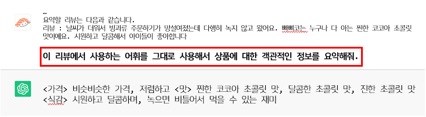
        
        저희가 의도한 출력은 다음과 같습니다.
        
        <aside>
        ✔️ <맛> 찐한 코코아 초콜릿 맛 <가격> 슈퍼와 비슷비슷 <맛> 시원하고 달콤해 <선호> 아이들이 좋아합니다. <맛> 진한 초콜릿 맛
        
        </aside>
        
        정성적으로 확인해보았을 때 약간의 오차가 존재하나, 의도한 출력과 매우 유사함을 확인하였고, 이를 최종 프롬프트 형식으로 결정하였습니다.
        
        최종 프롬프트는 다음과 같습니다.
        
        <aside>
        ✔️ **최종 ChatGPT 프롬프트 예시**
        
        ---
        
        ### 아이스크림 상품 리뷰를 보고 요약문을 생성해주세요.
        
        요구 사항은 다음과 같습니다:
        
        1. 상품에 대한 특성이 잘 드러나야 합니다.
        2. 맛, 식감, 가격, 양에 대한 내용이 있으면 꼭 요약문에 포함해야 합니다.
        3. 주어진 상품 리뷰에서 사용하는 단어를 그대로 사용해야 합니다.
        4. 문장이 아니라 절이나 구로 짧게 작성해야 합니다.
        5. 중복된 내용은 제거해야 합니다.
        6. <특성> 요약 형식으로 작성해야 합니다.
        
        ### 예시는 다음과 같습니다.
        
        리뷰 : 가격도 싸고 월드콘 구구콘 두 가지 콘 아이스크림 먹을 수 있어 재구매 하였습니다. 맛도 달콤하고 예전부터 있던 상품으로 변함없는 맛이 좋습니다. 구입 기준 제조일자는 3주 전입니다. 두 가지 맛을 동시에 가격은 더 낮게 구입할 수 있어 만족하며 달콤하고 씹는 식감도 좋아 가족 모두가 잘 먹었습니다.
        요약 :<가격> 싸고 <맛> 달콤하고 변함없는 맛 <맛> 두 가지 맛을 동시에 <가격> 더 낮게 <맛> 달콤하고 <식감>
        씹는 식감도 좋아
        
        ### 요약할 리뷰는 다음과 같습니다.
        
        리뷰 : (요약할 리뷰)
        
        ### 이 리뷰에서 사용하는 어휘를 그대로 사용해서 상품에 대한 객관적인 정보를 요약해줘
        
        </aside>
        
    
- **최종 데이터셋**
    
    ChatGPT로 데이터를 생성하다가 더 **효율적인 방법**이 필요하다 느꼈습니다. 따라서 자동으로 데이터를 생성하기 위해 **OpenAI API를 사용**하였습니다. 그 결과 ChatGPT로 생성한 152개의 데이터와 OpenAI API로 생성한 6033개의 데이터, **총 6185개의 요약 학습 데이터를 생성**했습니다.
    
    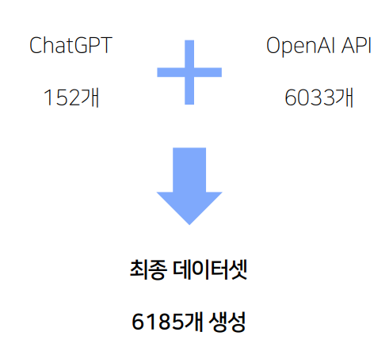
    

### 2-2 요약 모델 선정

- **0. KULLM (베이스라인)**
    
    우선 한국어로 학습되고 성능이 보장된 구름 모델을 테스트했습니다.
    
    그러나 리뷰에 비해 너무 짧게 요약되어 **필요한 정보를 많이 놓치는 것을 확인**했습니다.
    
    Few-shot으로 ‘<특성> 내용’ 형식으로 출력하도록 유도했지만, 예시의 내용까지 요약하는 문제가 있었습니다.
    
    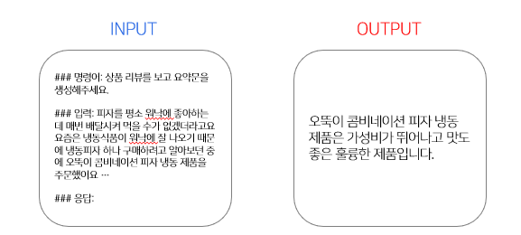
    

- **1. T5 요약모델 Fine-tuning 테스트**
    
    요약을 위한 모델을 모색한 결과 T5모델을 저희 데이터셋으로 fine tuning하여 테스트해보기로 하였습니다.
    
    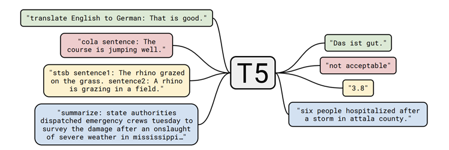
    
    아래의 그림을 보시면 target을 `<특성> 내용` 그리고 `내용` 이렇게 두가지로 학습을 시켰는데요, 그 결과 정성적으로 보았을 때 **상품의 특성을 대부분 담고 있**지만 **필요 이상의 문장을 출력**하여 요약이 덜 되는 문제가 있었습니다.
    
    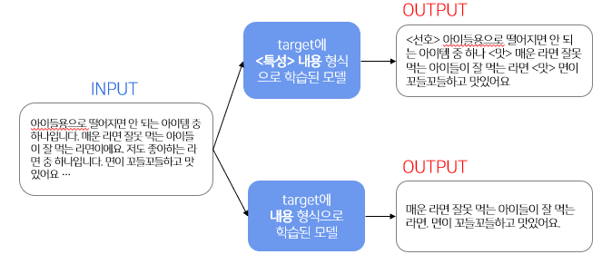
    
    그러나 **필요 없는 문장을 쳐낸다는 것**에 의의를 두고 이후 학습 시 `(1) target의 형식 변경 (2) 명령어 제거 (3) 최대 출력 길이를 변경`으로 성능 개선을 시도했습니다.
    

- **2.  KULLM Fine-tuning 테스트**
    
    KULLM 모델을 파인튜닝 했으나 좋은 성능을 보지 못했습니다.
    
    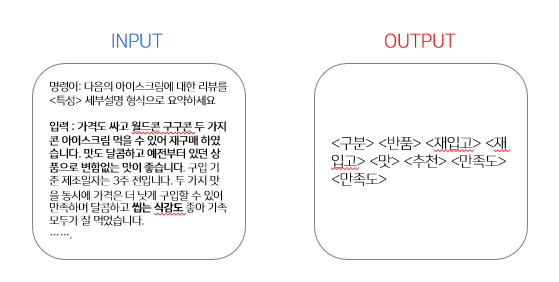
    
    **KULLM은 일반적인 지시 데이터로 학습**되어 **저희가 원하는 형식의 요약을 생성하기에는 부족하다고 판단**했습니다. 따라서 구름이 사용한 사전학습 모델인 **Polyglot-Ko를 자체 데이터셋으로 학습시키기**로 했습니다.
    

- **3. Polyglot-Ko-5.8B 파인튜닝**
    
    서버에서 돌릴 수 있었던 모델 중 가장 큰 58억 개 파라미터의 Polyglot-Ko 모델을 파인튜닝했습니다. 
    
    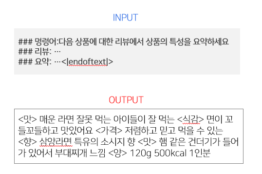
    
    그 결과 어느 정도 **내용을 잘 요약**하고 상품의 **어느 <특성>인지도 잘 분류**하는 것을 볼 수 있었습니다.
    

### 2-3 요약 모델 평가

- ************************************좋은 요약이란?************************************
    
    우선 본 프로젝트에서 **좋은 요약의 기준**을 다음과 같이 정의했습니다.
    
    1. 리뷰 단어 그대로 사용하기
    2. 상품의 특징에 대한 내용만 담기
    3. 중복되는 내용 제외하기
    
    이를 기반으로 평가 지표를 선정했습니다.
    
    리뷰에 있는 단어 그대로 포함되길 원하므로 **레퍼런스 기반인 Rouge** 계열 점수를 사용했습니다. 또한, Rouge 계열 점수는 의미가 같아도 단어가 다르면 점수를 받지 못하므로 조사, 어미 등이 점수에 혼동을 줄 것이라 생각했습니다. 따라서 **의미가 담긴 명사, 어간 등만 추출**해서 점수 계산에 사용했습니다.
    
- **평가 지표 선정**
    
    사용한 평가 지표는 다음과 같습니다.
    
    | RougeLsum | Summary-level RougeL
    문단을 문장으로 분리해서 각각 LCS 탐색 후 union에 대해 점수 계산 |
    | --- | --- |
    | Rouge2 | 2-gram 점수 계산 |
    | (참고) 소요 시간 | 하나의 리뷰를 요약하는 데 걸리는 시간 (초) |
    | (참고) 길이 차이 | 레퍼런스와의 길이 차이
    생성 결과 길이 - 레퍼런스 길이로 계산 |
    | (참고) 유사도 | 레퍼런스와 생성 결과 사이 유사도
    BM-K/KoSimCSE-roberta 모델로 임베딩을 구함
    레퍼런스 각 문장과 가장 유사한 생성 결과 문장 간의 유사도 평균값 |
    
    한국어는 **문장 대부분을 봐야 문맥을 파악**할 수 있어서 LCS 기반인 rougeL을 사용하고자 했습니다. 문장의 순서는 중요하지 않다고 생각해서 문서를 이루는 문장별로 점수를 내는 `RougeLsum`을 선택했습니다.
    
    그러나 **단어 순서가 다르면 점수를 받지 못 한다는 한계**가 있어 2-gram을 보는 `Rouge2`도 보조적으로 사용했습니다.
    
    서비스 측면에서 추론 시간은 중요하기 때문에 `소요 시간`을 참고 지표로 삼았습니다.
    
    Rouge 계열 점수는 **불필요한 정보가 들어간 정도**를 반영하지 못하기 때문에, `레퍼런스와의 길이 차이`를 통해 그 정도를 파악하려 했습니다.
    
    `유사도 점수`는 임베딩 모델의 성능에 영향을 받아서 주 평가 지표로는 사용하지 않았습니다.
    
- ********************************요약 모델 평가********************************
    
    앞서 진행했던 모델 학습에 대한 평가 결과입니다.
    

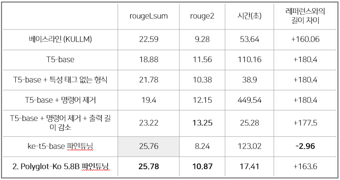

ke-t5-base 파인튜닝 모델의 rougeLsum 점수가 최대 점수와 차이가 없고, 레퍼런스와의 길이 차이가 적어서 본 프로젝트에 적합하다고 생각했습니다. 그러나 **************************정성적 평가에서 부정확한 내용**************************이 많이 들어간다는 문제를 발견했습니다.

따라서 저희는 ✨**Polyglot-Ko 5.8B 파인튜닝 모델**을 최종 모델로 선정✨하였습니다.

  

## 3️⃣ 어떻게 하면 비정형화된 **사용자의 피드백 데이터**를 다룰 수 있을까?

직접 사용자의 피드백을 받아보니 예상과 다른 부분이 너무 많았고, 정형화되지 않는 문제가 있었습니다.

과연 이런 데이터를 어떻게 프로젝트에 활용할 수 있을까요? 🤔

### 3-1 **피드백 데이터 분석**

저희는 알파테스트를 실시하여 실제 이용자들의 서비스 이용 형태를 알아봤습니다.

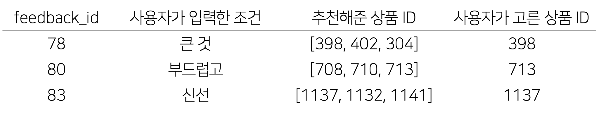

예상했던 것 보다 **입력이 짧고 정형화되어 있지 않음**을 것을 확인했습니다. 

또한 많은 캠퍼분들께서 알파테스트에 참여해주셨지만, 모델을 학습시키기에는 데이터가 부족했습니다.

이 때문에, 피드백 데이터를 **직접적**으로 사용하기엔 문제가 있을 것이라 판단했습니다.

이러한 사용자 입력과 **유사한** 데이터 생성 방법에 대해 새로운 아이디어를 얻어, 

피드백 데이터를 **간접적**으로 활용할 방안을 모색했습니다.

### 3-2 **유사 데이터 생성**

저희는 수집된 사용자의 데이터와 유사한 형태를 DB에서 찾을 수 있었습니다.

이렇게 사용자 **피드백의 쿼리와 비슷한 부분**을 리뷰에서 **추출**한다면 충분한 데이터를 만들어낼 수 있을 것 입니다.

하지만, 리뷰에서 직접 추출할 경우 모든 쿼리가 리뷰에 들어가 있기 때문에 사용자 피드백 데이터와 유사한 형태를 띄고 있다고 볼 수 없습니다.

이를 해결하기 위해 추출한 쿼리에 **KoEDA의 유사어 대치(SR)**를 적용하여 추출한 쿼리를 약간 변경했습니다.

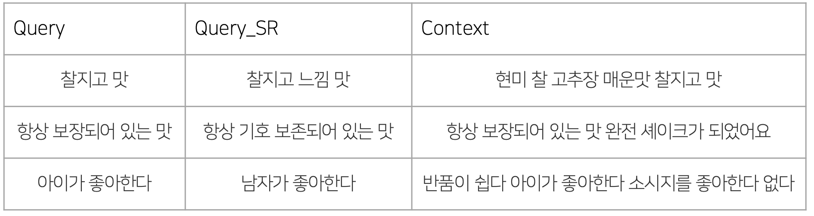

이렇게 만들어낸 데이터에서 실제 입력이 짧은 것을 감안하여 쿼리의 길이가 25 이하인 것만 수집하여 

약 **16000**개의 데이터를 생성해낼 수 있었습니다.

  

## 4️⃣ 어떻게 하면 서비스의 **결과를 보는 시간**을 줄일 수 있을까 ?

결국 중요한 것은 어쩌면 **서비스** 아닐까요? 🚚 

아무리 좋은 AI 기술도 사용자가 없으면 너무 아쉬울 수 밖에 없을 겁니다. 

저희는 사용자가 가장 견디기 힘든 **대기 시간을 줄이기 위해** 고민했습니다. 🎯

### 4-1 요약 데이터의 저장 유무

AI 요약 모델을 통해 리뷰 데이터를 요약문으로 만들기 위해서는 평균 10초 가량 소요가 되었습니다. 저희는 요약 데이터를 미리 데이터베이스에 저장해두어 요약에 필요한 **대기 시간을 제거**해주었습니다.

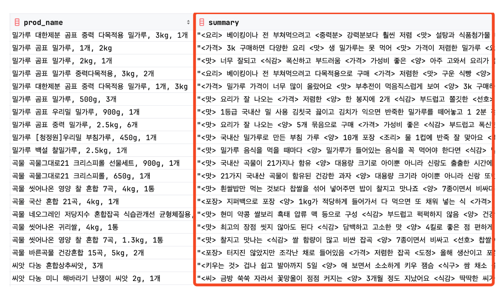

### 4-2 실시간 크롤링 시간

사용자가 검색한 데이터가 DB에 없는 경우 실시간 크롤링을 해야 합니다. 기존 1개 상품당 10개의 리뷰를 모으면 최소 40초에서 최대 1분 30초 정도가 소요됩니다. 

저희는 리뷰의 수를 3개로 줄여 **정보의 양**을 줄이는 대신 크롤링 소요 시간을 줄이는 전략을 취했습니다. 🏃‍♀️ 
**정보의 양 ↔ 소요시간의 트레이드 오프**였습니다. 크롤링 시간을 60% 가까이 줄일 수 있었습니다. 

또, **매일 50개의 검색어를 추가적으로 크롤링하는 스케쥴링**을 걸어놓음으로써 순수하게 많은 양의 데이터를 늘려 실시간 크롤링하는 경우가 발생하지 않도록 노력했습니다.

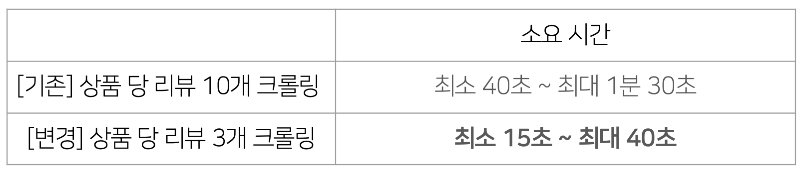

크롤링 리뷰 수를 3개로 줄여주니 시간이 60% 가까이 줄었습니다. 

**요약 데이터의 저장**과 **매일 50개의 검색어를 추가적으로 크롤링**하는 작업은 Airflow 를 이용해 스케쥴링을 걸어두었어요. 

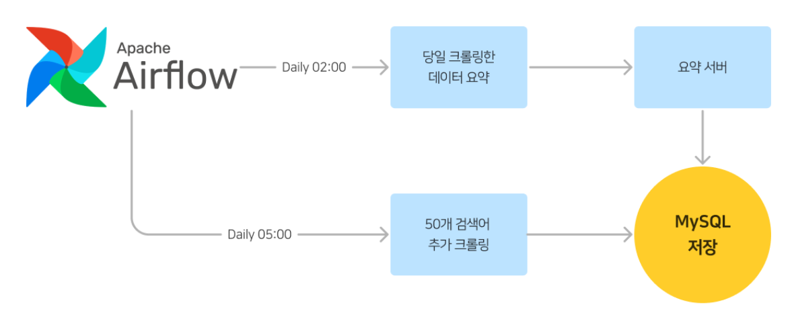

### 4-3 체감 시간 줄이기

절대적으로 줄일 수 없는 시간은 UI/UX를 통해 **체감 시간을 줄이는 시도**를 해주었습니다. ⏰

무작정 기다리는 것이 아닌 중간에 진행 과정을 확인할 수 있도록 제작했습니다.

6초마다 바뀌는 텍스트를 보여줌으로써 지루함 해소를 시도했습니다. 🕺

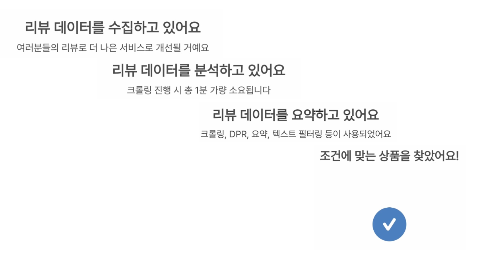

  

# 👨‍👨‍👧‍👦 우리 팀을 소개합니다.

---

## **권지은**

[lectura7942 - Overview](https://github.com/lectura7942)

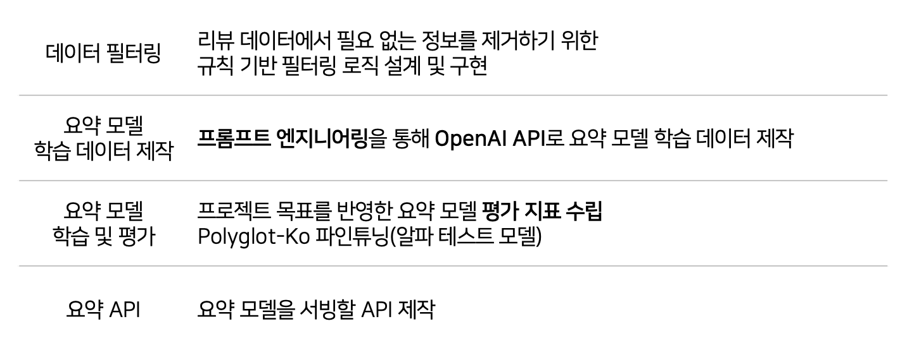

## **김재연**

[JLake310 - Overview](https://github.com/JLake310)

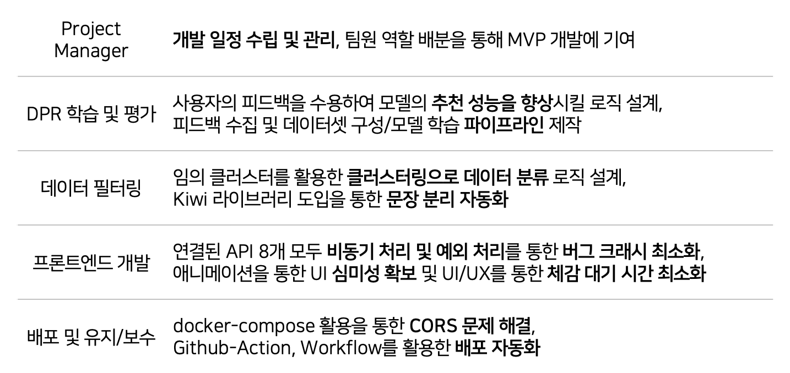

## **박영준**

[hoooolllly - Overview](https://github.com/hoooolllly)

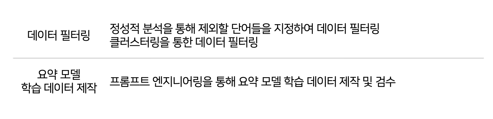

## **정다혜**

[Da-Hye-JUNG - Overview](https://github.com/Da-Hye-JUNG)

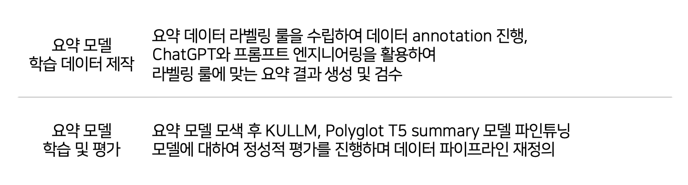

## **최윤진**

[yunjinchoidev - Overview](https://github.com/yunjinchoidev)

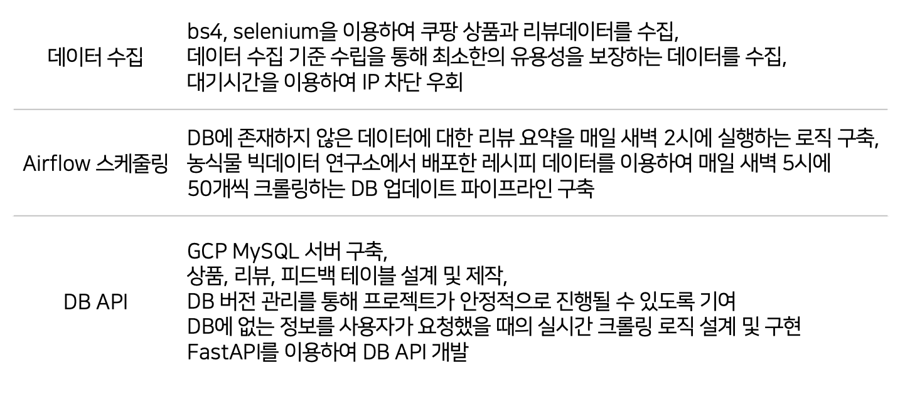

  

# ☝️ Wrap Up

## 프로젝트 타임라인

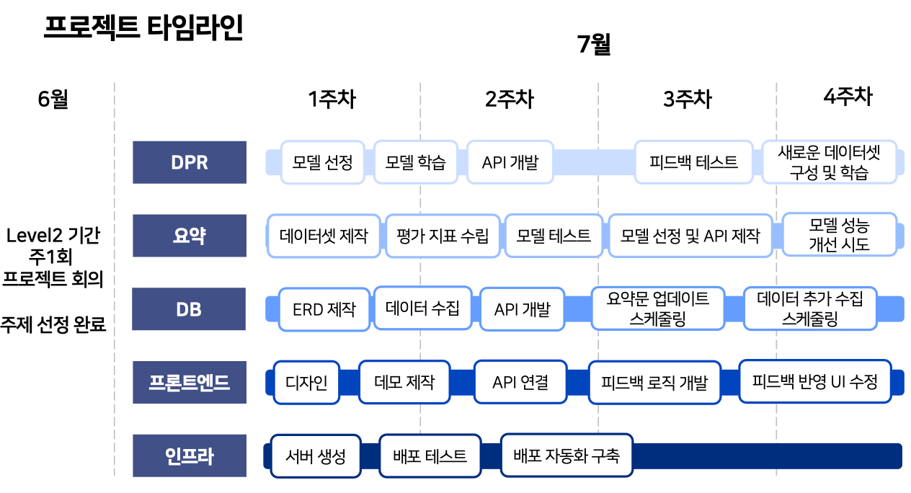

## 기술 스택

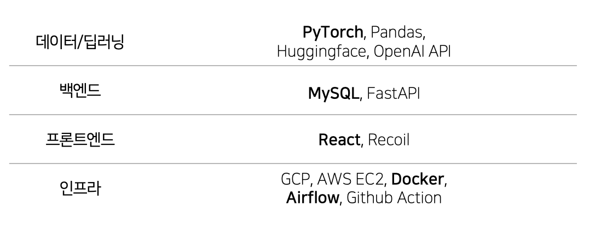

## 프로젝트 플로우 차트

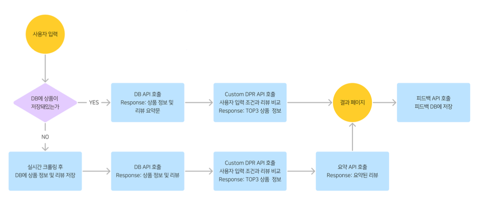

## 서비스 아키텍처

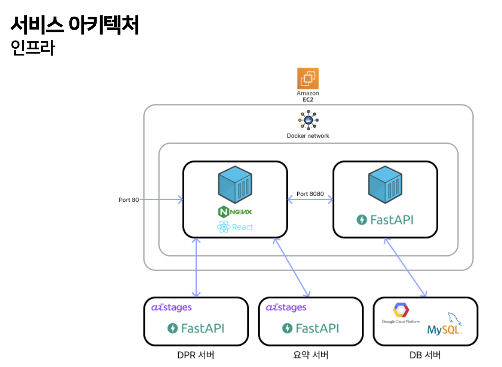

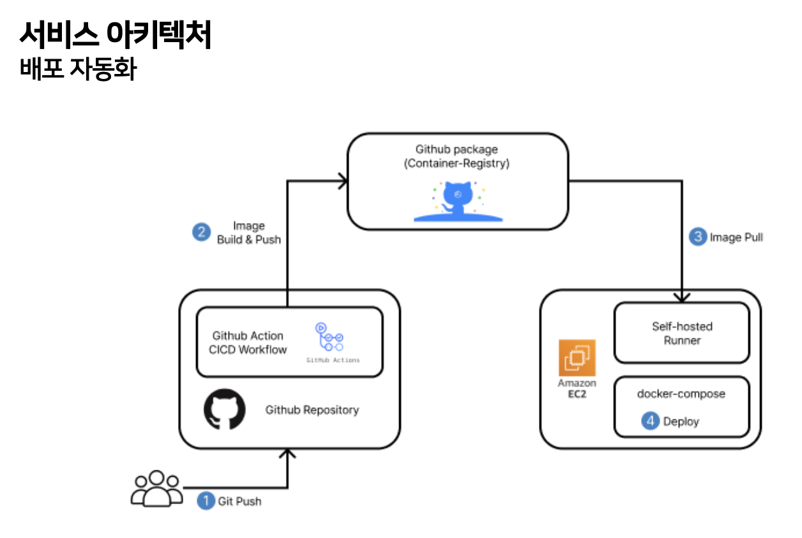

## ERD

아래 ERD 대로 MySQL 테이블을 만들고 수집한 데이터를 저장해줬습니다.

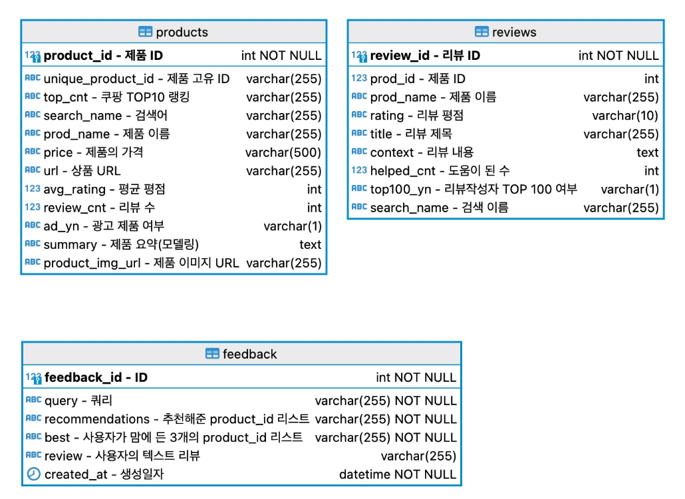

## 실제 데이터

아래와 같이 구성되어 있답니다. 

📌**상품 데이터**

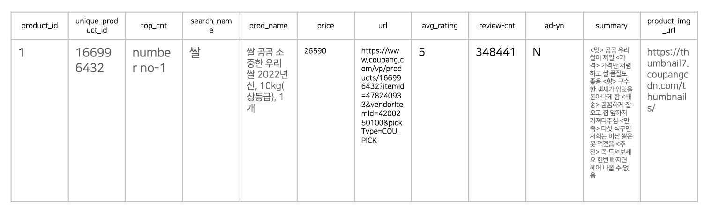

📌 **리뷰 데이터**

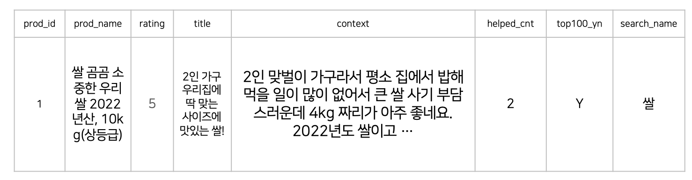

## 자체 평가 의견

### 프로젝트 달성도 및 완성도

- 실시간으로 크롤링하여 결과를 보여주는 부분까지 구현하고 배포하여, 프로젝트 초기에 수립한 목표는 모두 달성했다고 생각한다.
- 외부 데이터셋을 사용하지 않았기 때문에 프로젝트 그 자체로 완전함을 갖추었다고 생각한다.

### 프로젝트를 진행하면서 배운 점 혹은 성장한 점

- 짧은 기간 동안 타이트하게 일정을 조율하는 경험을 할 수 있었다.
- 서비스를 개발하고 알파테스트를 진행하여 피드백을 받았다. 이러한 피드백을 서비스에 반영하고 개선하며 사용자의 입장에서 한 번 더 생각해볼 수 있었다.
- 데이터 수집부터 배포까지 End2End로 AI 서비스를 만들어내면서, 실제 개발 과정에 대한 이해를 기를 수 있었다.
- 해결하고자 하는 문제에 맞는 평가지표를 선택하는 경험을 할 수 있었다.

### 프로젝트를 진행하면서 아쉬웠던 점

- 짧은 기간 동안 프로젝트의 배포까지 완수해야 하다보니, 모델링에 온전히 집중하지 못한 점이 아쉬웠다.
- OpenAI API로 제작한 데이터에 대한 검수가 부족한 것 같아서 아쉬웠다.
- 할루시네이션과 생성 결과 길이에 대한 평가 지표가 부족한 것 같아서 아쉬웠다.
- 피드백 데이터가 생각보다 안 모여서 제대로 활용할 수 없던 점이 아쉬웠다.

### 추후 개발하고 싶은 부분

- ColBERT로 retrieve를 시도해보고 싶다.
- API의 동기 요청을 통해 백그라운드에서 데이터를 수집하여 사용자의 대기 시간을 더 줄여보고 싶다.
- 크롤링 시간을 단축 시키고 싶다.

  

# 🙂 감사합니다.

지금까지 `연어보다자연어` 팀의 여정을 읽어주셔서 감사합니다.

  
해당 프로젝트는 네이버 커넥트재단의 부스트캠프 AI tech 5기에서 진행했습니다.
